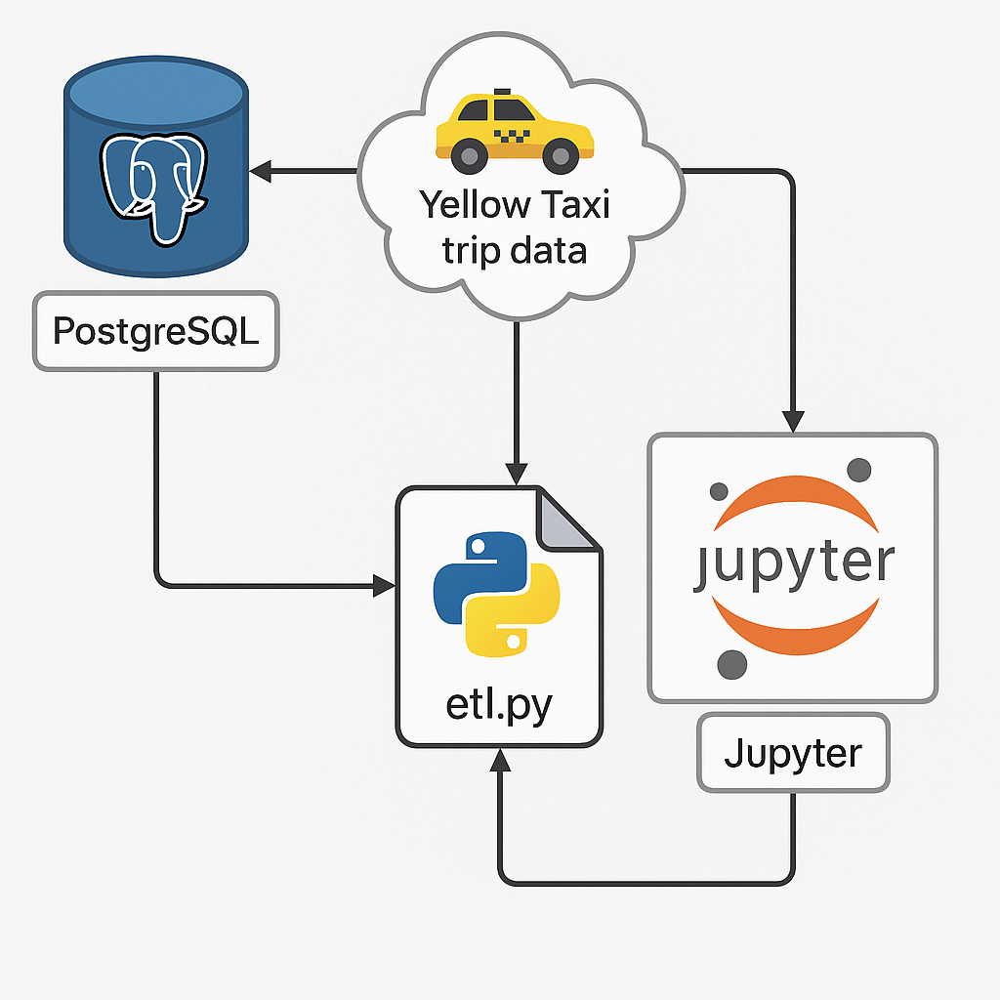

# NYC Yellow Taxi ETL Pipeline 🚖

This project builds a complete, containerized ETL pipeline to process and analyze NYC Yellow Taxi trip data. It uses Python, PostgreSQL, Docker, and JupyterLab for data engineering and exploration.

---

## 📌 Features

- Extracts public Parquet data from NYC Taxi & Limousine Commission
- Transforms and cleans trip data (filter, convert types, drop invalids)
- Loads structured data into a PostgreSQL database
- Provides Jupyter notebooks for exploratory data analysis
- Visual dashboards to uncover trends, outliers, and traffic behavior
- Fully Dockerized: easy to build, run, and extend

---

## 📊 System Architecture




---

## 🧱 Tech Stack

- **Python 3.10** – ETL, pandas, psycopg2, pyarrow
- **PostgreSQL 14** – Persistent structured data store
- **Docker + Compose** – Container orchestration
- **JupyterLab** – Interactive analysis + visualization
- **Seaborn/Matplotlib** – Data visualizations

---

## 📂 Project Structure

```
nyc-yellow-taxi-pipeline/
├── .env
├── .gitignore
├── docker-compose.yml
├── python-scripts/
│   ├── etl.py
│   ├── requirements.txt
│   └── Dockerfile
├── jupyter/
│   └── Dockerfile
├── notebooks/
│   └── yellow_taxi_full_dashboard.ipynb
├── A_flowchart_diagram_illustrates_a_data_processing_.png
└── README.md
```

---

## 🚀 Getting Started

### 1. Clone the repository

```bash
git clone https://github.com/yourusername/nyc-yellow-taxi-pipeline.git
cd nyc-yellow-taxi-pipeline
```

### 2. Setup Environment Variables

Create a `.env` file (already provided) with:

```
POSTGRES_USER=root
POSTGRES_PASSWORD=root
POSTGRES_DB=yellow_taxi
```

### 3. Start the pipeline

```bash
docker-compose up --build
```

Then open: [http://localhost:8888](http://localhost:8888)

---

## 📓 Notebooks

- `notebooks/yellow_taxi_full_dashboard.ipynb` – answers 12 research questions:
  - Trip volume by hour/day
  - Distance vs duration
  - Outlier detection
  - Passenger analysis
  - Trip length categories
  - Data quality checks

---

## 📈 Example Research Questions

- What are peak hours by day?
- How long are trips on average by hour?
- Are there zero-distance or zero-passenger records?
- What percentage of trips are long vs short?

---

## 🧹 To Reset the Pipeline

```bash
docker-compose down -v --rmi all
```

---

## 🤝 Contributions

Pull requests welcome. Let's explore NYC together. 🌆
